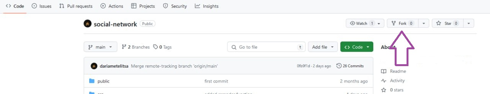

# :wave: Samurai Social Network

**Экспериментальный** студенческий проект. Цель - сделать нечто близкое к соцсети "Путь самурая", но с использованием актуального технологического стека.

## Запуск проекта
- для npm `npm start`
- для yarn `yarn start`

## Деплой на gh-pages
- для npm
	- `npm run deploy`
- для yarn
	- `yarn build`
	- `yarn deploy`

## Чтобы получать обновления из удаленного репозитория:
1. Сделать `fork` этого проекта (одна из четырех кнопок в правом верхнем углу github -> `create fork`).   

       

2. Клонировать проект на компьютер из своего репозитория:   
    
    - копируем ссылку, предпочтительно использовать SSH (зеленая кнопка `Code` в **вашем** репозитории)
    - в консоли на ПК в папке с проектами прописываем команду `git clone` + скопированная ссылка 
  
	`git clone git@github.com:YOUR-USERNAME/YOUR-REPOSITORY.git`

3. Установить зависимости:
    - для npm `npm install`
    - для yarn `yarn install`
4. Создать новую ветку для работы. В ней и будет проходить ваша вся основная работа
	`git checkout -b *branch-name*`

 :warning: **Если хотите сохранить возможность выкачивать новые изменения, не сливайте вашу уникальную ветку с main.** 

## Чтобы подтянуть удаленные изменения себе
- в своем репизитории на github проверяем, что выставлена ветка `main` (стрелка 0), нажимаем на кнопку `Synk fork` -> `Update branch`    
  
    

- после обновления при клике на кнопку выдастся сообщение "This branch is not behind the upstream". Это означает что вы успешно обновились и подтянули все актуальные изменения.    
  
  

- в IDE в проекте нужно переключиться на ветку `main`:
    -  в консоли ввести `git checkout main` или воспользоваться интерфейсом программы для переключения между ветками
    - в консоли ввести `git pull` или воспользоваться интерфейсом программы для обновления (web storm команда `Ctrl + T`)

:sunglasses: **Готово!**
Обновления скачаны из удаленного репозитория. Теперь для работы не забудьте вернуться в свою рабочую ветку `git checkout *branch-name*`

## Сравнение файлов

Если вы не успели или хотите что-то разобрать из основного проекта, можно воспользоваться функцией сравнения файлов

1. **Для Web Storm**
- убедитесь, что находитесь в своей ветке проекта. Проверить это можно или в интерфейсе IDE, или с помощью команды `git branch`
- в файлах проекта выберите интересующий файл, вызовите контекстное меню и выбрите `git` -> `Compare with Branch...`    
  

- выберите для сравнения `main`    
  

- Результат команды будет такой    
  

2. **Для VS Code**
- убедитесь, что находитесь в своей ветке проекта. Проверить это можно или в интерфейсе IDE, или с помощью команды `git branch`
- в файлах проекта выберите интересующий файл, вызовите контекстное меню и выбрите `git` -> `Compare with Branch...`    
  

- выберите для сравнения `main`    
  

- Результат команды будет такой    
  

